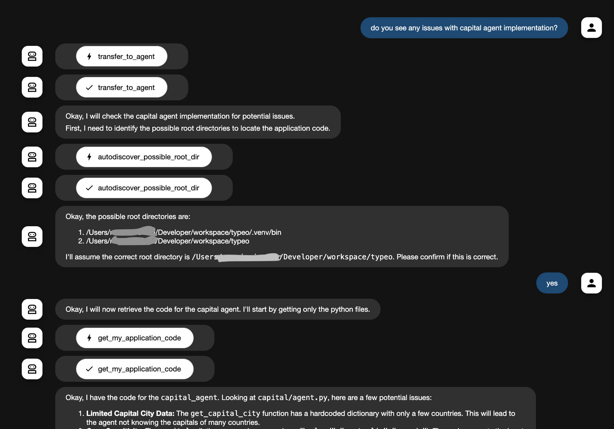

[](https://badge.fury.io/py/self-code-adk)
[](https://codecov.io/gh/n0npax/self-code-adk)

# self code adk

Agent which can read code of currently running application and help analyzing it.
Its main purpose is to assist in debugging the whole application. It is defined as a developer and multi-agent expert which can read the entire codebase.
For example, you can ask it how to **adjust other agents prompts** when they don't act as intented.

## usage

### install the package

```sh
uv add self-code-adk
```
### import it

```python
from self_code_adk.agent import SelfCodeAgent
```

### And add new sub agent

```diff

sub_agents=[gardener, weather],
+# include self_code_agent only for development purposes
+if dev_mode: 
+   self_code_agent=SelfCodeAgent("gemini-2.5-flash-preview-04-17")
+   sub_agents.append(self_code_agent)
root_agent = Agent(
    name="my-fancy-agen",
    model="gemini-2.5-flash-preview-04-17",
    description=("root agent which acts as coordinator"),
    instruction=(
        """
        blah   
        """
    ),
    sub_agents=sub_agent,
)
```

## Security considerations

`self-code-adk` has access to app code and whole filesystem. It states a security risk and should never be run in production. It is designed purerly for local testing within trusted input.

> Note: if LLM instructed in malicious way, it may read any file. For example /etc/shadow. Even if LLM will reject request initialy, there is no secondary protection in place.

## How it works

In short it is an agent with 2 tools:

1. find possible root directory with app code and confirm selection with operator.
2. read the content of repository

Thats is all. LLM with instruction takes care of rest.

> Note: Attempt to discover the source directory and confirm it with operator exists as there is no clear way to auto-discover it in resiliant way. Entrypoint of program varies depending on how it was started, for example `gunicorn`, `uv`, direct execution, etc.

## design

`self-code` is just an agent which can access the code. It can be plugged into an multiagent app and then app relevant questions will be delegated on demand.


## sample chat

Here is screenshot of sample chat of multiagent app. App contains few agents, and one of them is returning capital cities for a country using a tool. Once asked, `self-code` agent reads and provides feedback on code quality.

I'm usually asking questions like:
- do you see any issues with current code?
- **you didn't do `xyz`, how to adjust your prompt, so next time you would act differently**



## name

In Python, `self` is used to refer to attributes within a class instance. This agent accesses application source code, so its name was intended to mimic the `self.code` approach.

---

[medium article](https://medium.com/me/stats/post/d8c08464f293)
