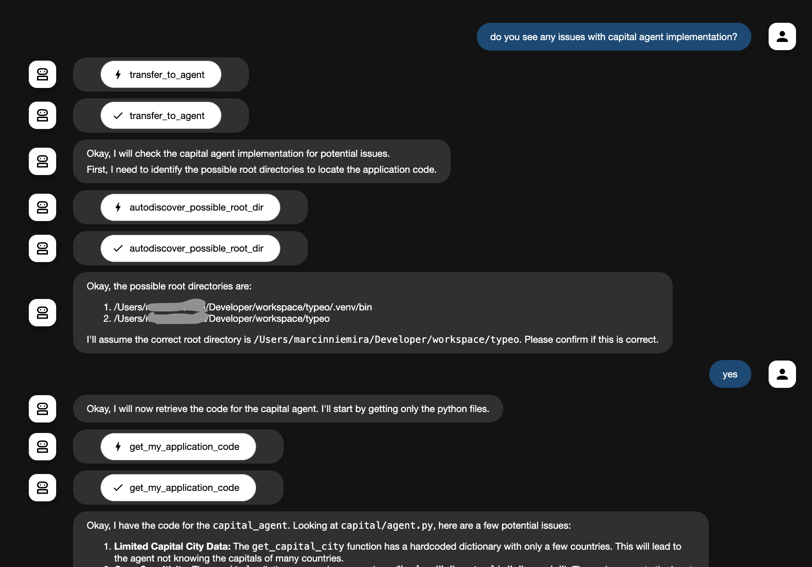

# sample chat

Here is screenshot of sample chat of multiagent app. App contains few agents, and one of them is returning capital cities for a country using a tool. Once asked, `self-code` agent reads and provides feedback on code quality.

